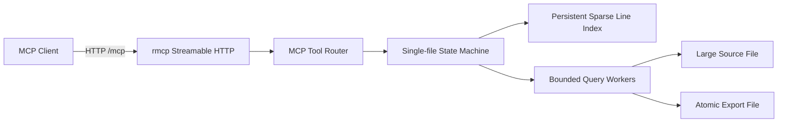

# 设计说明

## 目标

服务需要处理 800 GiB 以上的按行文件，同时保证：

- 首次扫描以磁盘顺序吞吐为主，不产生与总行数等比例的巨大逐行索引。
- 任意行号可以在少量有界 I/O 后定位。
- 任意正则和字面量搜索都只能扫描调用方明确指定的行数。
- 返回和导出过程具有明确的内存上限。
- MCP 只使用标准 Streamable HTTP，不实现 stdio 或旧式独立 SSE 端点。

## 组件



状态机只有 `no_file`、`indexing`、`ready`、`failed` 四种状态。打开第二个文件前必须调用 `close_file`，从接口层保证单活动文件语义。

## 为什么不使用逐行偏移表

逐行保存一个 `u64` 偏移，在短行文件上会非常大。例如 800 GiB 文件若平均每行 10 字节，大约有 80 亿行，仅偏移就需要约 64 GiB，无法接受。

本实现按字节距离建立稀疏检查点：距离上一个检查点达到 `checkpoint_bytes` 后，在下一个换行处记录：

```text
IndexEntry {
    line:   u64,  // 该行的一基行号
    offset: u64,  // 该行首字节偏移
    crc32:  u32
}
```

默认间隔为 8 MiB。索引记录数量主要由文件字节数决定，而不是由行数决定，因此极短行和极长行都不会使索引失控。

## 索引建立

1. 规范化源路径并读取大小、修改时间。
2. 计算路径哈希以及文件头尾各 64 KiB 的快照哈希。
3. 检查对应的完整索引；身份和配置一致则直接复用。
4. 否则读取 `.partial` 文件中的 CRC 正确记录，从最后一个行首偏移继续。
5. 使用 32 MiB 缓冲顺序读取源文件。
6. 使用 SIMD 字节计数统计换行，仅在跨越检查点阈值时查找具体换行位置。
7. 完成后重新验证源文件身份，写入完整头部并原子重命名为 `.tsidx`。

进程崩溃时，头部 CRC 或记录 CRC 可识别撕裂写。恢复最多重复扫描一个检查点区间；若存在超过检查点大小的单行，则最多重复该单行。

## 索引文件

固定 160 字节头部包含：

- Magic 和格式版本。
- `building` 或 `complete` 状态。
- 源文件大小和修改时间。
- 检查点字节间隔。
- 完整行数和记录数。
- 规范路径 SHA-256。
- 文件头尾样本 SHA-256。
- 头部 CRC32。

后续为固定 20 字节小端记录。索引文件名是源身份与索引配置的 SHA-256，因此不同快照或不同间隔不会相互覆盖。

## 行号定位

给定目标行 `L`：

1. 在内存中的检查点数组按行号二分，复杂度为 `O(log C)`。
2. 跳转到最近且不大于 `L` 的检查点。
3. 分块读取并用 SIMD 统计换行。
4. 仅在包含目标换行的最后一个块中枚举换行位置。

默认情况下，定位读取量约小于 8 MiB。因为检查点只能落在行边界，超长单行是唯一无法严格限制字节距离的情况。

## 读取

`read_lines` 分别定位起始行和结束行的偏移，只分配最终返回区间所需的缓冲。若该区间超过 MCP 内容上限，在分配前直接拒绝，避免内存突增。

复杂度：

```text
O(log C + checkpoint_scan + returned_bytes)
```

## 搜索

任意正则表达式无法通过一个通用预索引回答。服务采用可预测的最优通用途径：

1. 用行索引快速定位 `start_line`。
2. 用行索引定位调用方 `max_scan_lines` 对应的尾后行；服务端不再施加额外的搜索行数上限。
3. 利用范围内已有的行边界检查点，把字节区间切成最多 `search_threads` 个近似等大小的连续块；小范围保持单线程，避免线程开销。
4. 每个工作线程使用独立文件句柄和已编译匹配器。字面量、区分大小写时复用 `memmem::Finder`；正则或不区分大小写时克隆一次编译的 Rust regex 自动机。
5. 区分大小写的字面量搜索按读取缓冲批量枚举候选位置，再与换行位置归并，仅对候选所在行生成结果；正则保持逐行匹配。只在行跨缓冲区或确认命中时复制数据。
6. 各块通过零容量同步通道按有界小批次、原始行序归并，降低高命中率下逐条唤醒的开销；达到匹配数或内容上限后取消其余工作，`next_line` 与单线程扫描保持一致。

Rust regex 保证线性时间匹配，不支持会造成灾难性回溯的反向引用和环视。单行、模式、匹配数和返回内容均有独立上限。

复杂度：

```text
O(log C + checkpoint_scan + scanned_bytes)
```

## 导出

`export_lines` 不逐行复制：

1. 独立定位首行和尾后行偏移。
2. 计算精确字节区间。
3. 使用固定 8 MiB 缓冲流式复制。
4. `flush` 和 `sync_all` 后原子发布临时文件。

因此内存复杂度为 `O(checkpoint_buffer + 8 MiB)`，与导出大小无关。

## 并发

- 索引构建在 `spawn_blocking` 工作线程中执行，不阻塞 Tokio HTTP 调度线程。
- 读取、搜索、导出也在阻塞线程中执行。
- 搜索按已有索引检查点拆分连续字节范围，每个工作线程使用独立的顺序读取文件句柄；线程数可配置，自动模式最多使用 8 个。
- 已编译正则按工作线程克隆以避免匹配缓存竞争，归并通道不缓存匹配结果，避免内存随命中数和线程数无界增长。
- 实际工作线程数还受全局搜索内存预算约束。预算按最大并发查询数平分，并保守计入每个线程的读取缓冲、最大行缓冲和一个在途匹配；预算过小时退化为单线程。
- 显式搜索线程数上限为 32。HTTP 请求取消会设置共享取消标记，阻塞任务继续持有查询许可，直到所有工作线程停止，避免取消请求绕过全局并发限制。
- `Semaphore` 限制并发磁盘查询，默认 4。
- 每个查询打开独立只读文件句柄，避免共享 seek 游标和全局文件锁。
- 状态转换使用短时异步锁，实际文件 I/O 不持有状态锁。

## 一致性

服务将源文件视为静态快照：

- 建索引前后验证大小、修改时间和头尾样本。
- 每次查询前后验证大小和修改时间。
- 发现变化后状态切换为 `failed`，旧索引不会继续用于新内容。

若外部程序修改文件中部，同时故意保持大小、修改时间及头尾样本完全不变，则无法在不重新读取整个文件的前提下检测。部署时应对活动文件使用只读权限或快照卷。

## HTTP 与安全

- 唯一 MCP 传输入口为 `/mcp`，使用 Streamable HTTP。
- `/healthz` 仅用于存活检查，和 MCP 入口使用相同认证中间件。
- 非回环监听默认要求 Bearer Token。
- MCP 传输层校验 `Host`，可配置浏览器 `Origin` 白名单。
- 导出路径必须位于规范化后的 `export_root`，并拒绝覆盖活动源文件。
- 远程部署应由反向代理提供 TLS、请求大小限制和网络访问控制。
